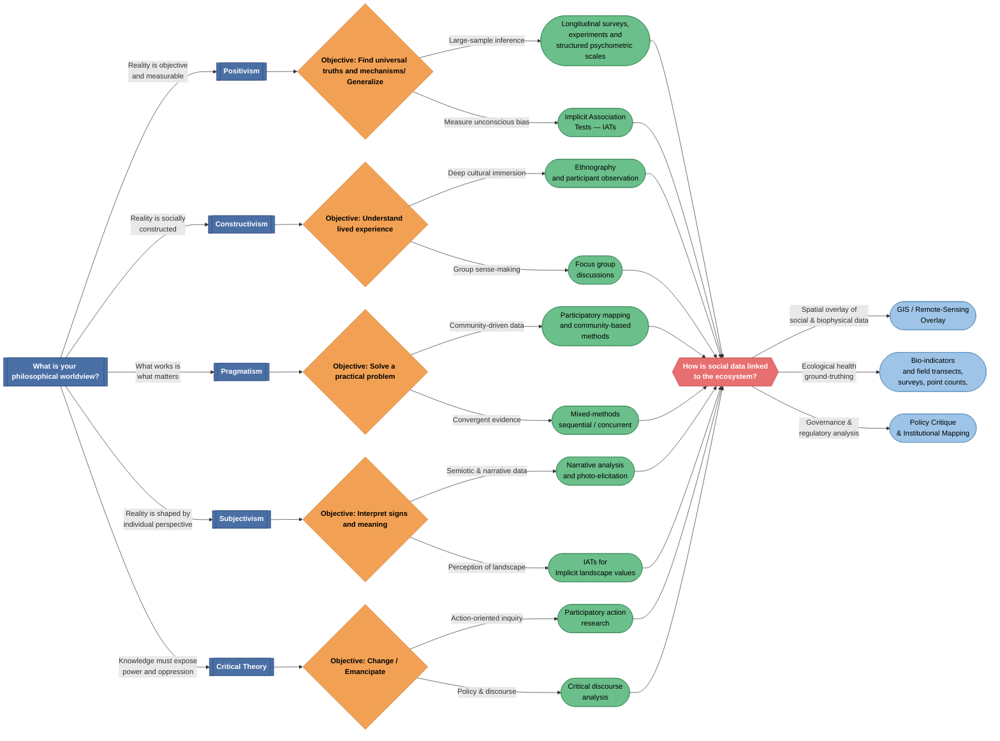

# SES Method-Selection Decision Tree

> A four-layer decision aid for choosing research methods in **Socio-Ecological Systems (SES)** fieldwork.
> Edit the [Mermaid](https://mermaid.js.org/) graph below and preview it in GitHub, VS Code, or the [Mermaid Live Editor](https://mermaid.live/).

---

## Decision Tree

---

## Node-Shape Legend

| Shape | Syntax | Meaning |
|-------|--------|---------|
| `[[ ]]` Subroutine | `[[Positivism]]` | Philosophical / paradigmatic choice |
| `{ }` Diamond | `{Objective: Generalize}` | Decision point (what you want to achieve) |
| `([ ])` Stadium | `([Longitudinal Surveys])` | Concrete data-collection method or tool |
| `{{ }}` Hexagon | `{{"Ecological Linkage?"}}` | Integration checkpoint (the SE bridge) |

---

## Methodological Justification

### Why four layers?

1. **Layer 1 — Epistemology first.**
   Methods are never paradigm-neutral. A longitudinal survey designed under Positivism asks *different* questions (and accepts *different* evidence) than a participatory map produced under Pragmatism. Starting from worldview forces the researcher to make ontological assumptions explicit, which is the single largest source of hidden bias in SES research (Moon & Blackman, 2014).

2. **Layer 2 — Objective as filter.**
   The same paradigm can still serve different goals. Constructivism may aim to *understand* place-attachment **or** to *interpret* semiotic meaning in landscape narratives. Splitting objective from paradigm prevents premature method lock-in and keeps the design coherent with the actual research question.

3. **Layer 3 — SES-specific methods.**
   Standard social-science method menus omit tools that are critical for human–environment coupling:
   - **IATs** capture unconscious environmental attitudes that self-report scales miss (Greenwald et al., 1998). Listing them here reminds the researcher that *implicit* cognition can drive resource-use behavior.
   - **Participatory Mapping** is included under Pragmatism because it generates spatially explicit social data that can be directly overlaid with ecological layers—something neither a survey nor an interview can do on its own.
   - **PAR / CDA** under Critical Theory acknowledge that many SES conflicts are fundamentally about power over resources; methods must surface that power.

4. **Layer 4 — The Ecological Linkage checkpoint.**
   This is the layer most often missing from social-survey guides. In SES work the *social* dataset is only half the story. Forcing every method path through the "How is social data linked to the ecosystem?" node ensures the researcher explicitly chooses an integration strategy:
   - **GIS / Remote-Sensing Overlay** — ties survey or mapping data to land-cover, NDVI, or habitat layers.
   - **Bio-Indicators & Field Transects** — ground-truths perceptions with measurable ecological condition (e.g., water quality, species richness).
   - **Policy Critique & Institutional Mapping** — links discourse or governance data to regulatory structures that shape the SES.

   Without this bridge, a study risks producing social findings that float free of the ecological system they claim to explain.

---

## How to update the SVG

1. Copy the Mermaid code block above.
2. Paste it into the [Mermaid Live Editor](https://mermaid.live/).
3. Export as **SVG** and overwrite `decision_tree.svg` in this folder.
