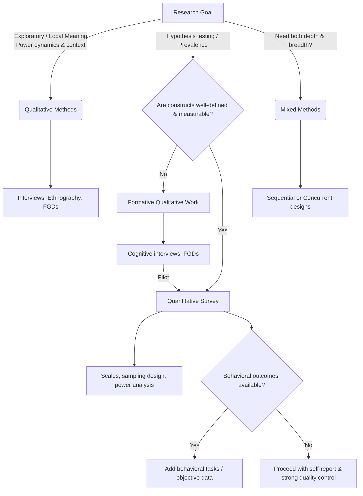

# Editable Decision Tree

You can edit this [Mermaid](https://mermaid.js.org/) graph and preview it directly in GitHub or text editors that support Mermaid rendering.

To update the SVG image in this folder:
1. Copy the code above.
2. Paste it into the [Mermaid Live Editor](https://mermaid.live/).
3. Export as SVG and overwrite `decision_tree.svg`.
