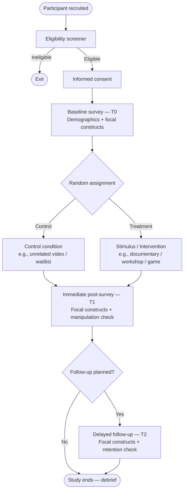

# Survey Flow Diagram — Template

Sketch your survey administration flow here using the Mermaid diagram below, then export as an image for your pre-registration and manuscript supplement.

> **Instructions:** Edit the Mermaid block to match your study. Render with any Markdown previewer that supports Mermaid (VS Code with Mermaid extension, Obsidian, GitHub, etc.).

---

## Generic BACI Flow (edit to match your study)

---

## Notes on Flow Design

| Decision point | Your choice | Rationale |
|---|---|---|
| Is the baseline survey separated from the stimulus by > 24 h? | ☐ Yes  ☐ No | Reduces demand characteristics |
| Is the condition assignment hidden from participants? | ☐ Yes  ☐ No | |
| Are attention checks embedded? Where? | | |
| Are manipulation checks embedded? Where? | | |
| Is there a debriefing page? | ☐ Yes  ☐ No | Required if deception used |
| What platform delivers the survey? | | |
| What platform delivers the stimulus (if online)? | | |

---

## Attrition Tracking

| Wave | Invited | Started | Completed | Drop-off rate |
|---|---|---|---|---|
| T0 Baseline | | | | |
| T1 Post | | | | |
| T2 Follow-up | | | | |

Expected attrition rate (from literature or pilot): _______ %  
Baseline oversampling multiplier applied: _______ × target N  
*(See `../Step_09_Power_and_Sampling/` for calculations)*

---

*Cross-reference: `study_design_checklist.md` §6 · `randomization_plan.md` · `../Step_05_PreRegistration/`*
