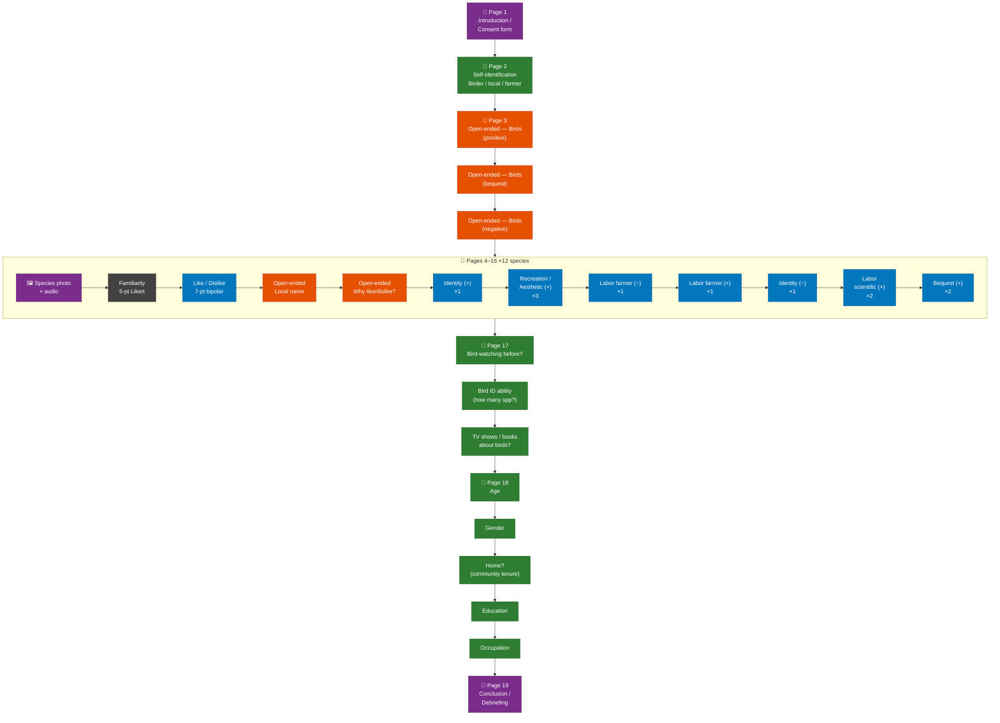

# Survey Flow Diagram — Echeverri et al. (2019)
## *Iconic Manakins and Despicable Grackles — Bird Valuation Survey, Guanacaste, Northwestern Costa Rica*

This document provides two representations of the survey flow:
1. A **Mermaid flowchart** (renders in GitHub, VS Code with Markdown Preview Mermaid extension, or Obsidian).
2. A **narrative description** with colour-coded variable roles for contexts where Mermaid is unavailable.

---

## 1. Mermaid Flowchart

> Paste the code block below into [https://mermaid.live](https://mermaid.live) to render and export as SVG/PNG.



---

## 2. Colour-coded Legend

| Colour | Variable role | Examples in this survey |
|---|---|---|
| 🟣 **Purple** | Not included in analyses | Consent form, conclusion |
| 🟢 **Green** | Independent variables | Birder/farmer/local identity, demographics, birding experience |
| 🔵 **Blue** | Dependent variables | Like/dislike, all Avian CES subscale items |
| 🟠 **Orange** | Qualitative data (supplement) | All open-ended items |
| ⚫ **Dark grey** | Random effects | Species familiarity (crossed random effect in mixed models) |

---

## 3. Page-by-page Narrative Summary

### Page 1 — Introduction / Consent *(not in analyses)*
Verbal introduction to the study, explanation of voluntary participation, and signing of consent form. Always administered first.

### Page 2 — Self-identification *(independent variables)*
Three binary items establishing participant group membership:
- Are you a **birder**?
- Are you a **local resident**?
- Are you a **farmer**?

Placed *before* bird stimuli to avoid demand bias.

### Page 3 — General open-ended items *(qualitative supplement)*
Three free-text questions about birds in the area, eliciting positive values, bequest values, and negative interactions. Placed *before* Likert blocks to prevent scale-language anchoring.

### Pages 4–16 — Bird-species loop ×12 *(dependent variables + qualitative)*
Each of 12 focal species received the same sequence:
1. Photo + audio playback stimulus
2. Familiarity (5-pt Likert) — *random effect covariate*
3. Like/dislike valence (7-pt bipolar) — *primary dependent variable*
4. Open-ended: local name — *qualitative*
5. Open-ended: why like/dislike? — *qualitative*
6–12. Avian CES subscale items (11 items per species):
   - Identity positive ×1
   - Recreation / aesthetic ×3
   - Labor farmer negative ×1
   - Labor farmer positive ×1
   - Identity negative ×1
   - Labor scientific ×2
   - Bequest ×2

Species order was **randomized** across participants. CES item order within each loop was **fixed**.

### Page 17 — Birding experience *(independent variables)*
Three items measuring prior experience, identification ability, and media engagement with birds.

### Page 18 — Demographics *(covariates)*
Age, gender, community tenure, education, and occupation. Placed at **end of survey** per best practice (Danaher & Crandall, 2008) to minimize social identity threat priming (Steele & Aronson, 1995).

### Page 19 — Conclusion *(not in analyses)*
Thank-you message, debriefing, and researcher contact information.

---

## 4. Analytic Implications of the Design

```
Mixed-effects model structure (conceptual):

CES_value ~ Birder_ID + Farmer_ID + Local_ID          # fixed: participant-level IVs
           + Familiarity                               # fixed: species-level covariate
           + (1 | ParticipantID)                       # random: participant
           + (1 | SpeciesID)                           # random: species
           + (Birder_ID | SpeciesID)                   # random slope: group × species
```

The crossed random-effects structure accounts for:
- **Participant variance**: some people rate all birds higher or lower on average.
- **Species variance**: some species elicit higher values on average.
- **Group × species interactions**: e.g., farmers may systematically differ from birders for crop-damaging species.

---

## 5. Design Lessons for Future Studies

| Design choice | Rationale | Relevant citation |
|---|---|---|
| Species order randomized | Controls fatigue and ordering/priming effects | Tourangeau et al. (2000) |
| Demographics placed last | Reduces social identity threat | Danaher & Crandall (2008); Steele & Aronson (1995) |
| Open-ended items before Likert | Prevents scale anchoring of qualitative responses | Schwarz (1999) |
| Audio + photo stimuli | Improves ecological validity; species recognition is not assumed | Echeverri et al. (2019) |
| Familiarity as random covariate | Species familiarity confounds valuation; must be modelled | Kellert (1993) |
| Binary group IDs (P2) before stimuli | Cleanly separates group membership from stimulus-specific responses | — |

---

## References

- Echeverri, A., Naidoo, R., Karp, D. S., Chan, K. M., & Zhao, J. (2019). Iconic manakins and despicable grackles: Comparing cultural ecosystem services and disservices across stakeholders in Costa Rica. *Ecological Indicators*, 106, 105454.
- Schwarz, N. (1999). Self-reports: How the questions shape the answers. *American Psychologist*, 54(2), 93–105.
- Danaher, K., & Crandall, C. S. (2008). Stereotype threat in applied settings re-examined. *Journal of Applied Social Psychology*, 38(6), 1639–1655.
- Steele, C. M., & Aronson, J. (1995). Stereotype threat and the intellectual test performance of African Americans. *Journal of Personality and Social Psychology*, 69(5), 797–811.
- Tourangeau, R., Rips, L. J., & Rasinski, K. (2000). *The Psychology of Survey Response*. Cambridge University Press.
